id: vibe-coding-line-mini-app
title: Vibe Coding LINE MINI App with AI Studio
summary: Codelab นี้สอนการสร้างเว็บจองร้านอาหาร แปลงเป็น LINE MINI App และส่ง Service Message ทั้งหมดด้วย Prompt ใน Google AI Studio
authors: Punsiri Boonyakiat, Pamorn Trivorrarat
categories: LINE MINI App, AI Studio
tags: LINE MINI App, AI Studio, Vibe Coding, Service Message
status: Published
url: vibe-coding-line-mini-app
Feedback Link: https://forms.gle/xXkqeFE3vLSubP1f9

# Vibe Coding LINE MINI App with AI Studio

## บทนำ
Duration: 0:05:00

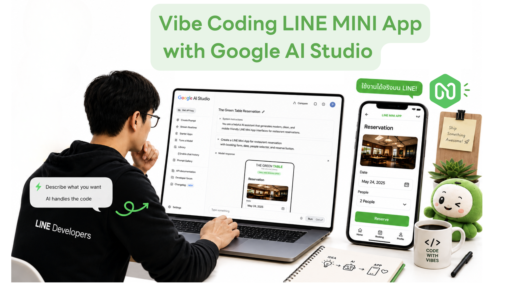

ถ้าคุณมีเว็บไซต์อยู่แล้ว หรือกำลังพัฒนาเว็บไซต์ด้วยการ Vibe Coding คุณสามารถนำเว็บไซต์นั้นมาต่อยอดเป็น LINE MINI App ได้อย่างรวดเร็ว โดยไม่ต้องเริ่มพัฒนาใหม่ตั้งแต่ต้น

Codelab นี้ออกแบบมาในรูปแบบ Workshop แบบ Hands-on โดยเริ่มจากการใช้ Prompt สร้างเว็บไซต์จองร้านอาหารด้วยจากนั้นนำเว็บไซต์ดังกล่าวมาต่อยอดเป็น LINE MINI App ด้วยการสั่งงาน AI

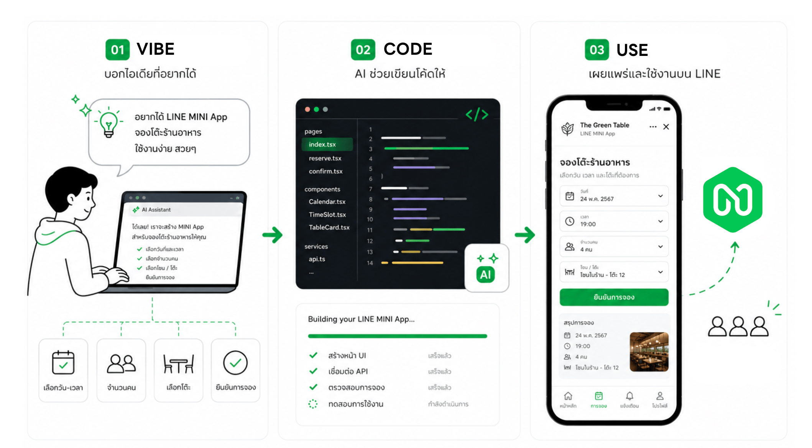
### สิ่งที่คุณจะได้ลงมือทำ

- สร้าง Provider และ LINE MINI App Channel ใน [LINE Developers Console](https://developers.line.biz/console/)
- สร้างเว็บจองร้านอาหารด้วยการ Prompt ใน [Google AI Studio](https://ai.studio/build/)
- ใช้ Prompt ใน Google AI Studio เพื่อแปลงเว็บไซต์ให้เป็น LINE MINI App และเชื่อมต่อข้อมูล LINE User Profile มาแสดงบนหน้าแอปโดยอัตโนมัติ
- แชร์การจองให้เพื่อนหรือกลุ่มด้วย Share Target Picker ผ่าน Prompt
- ตั้งค่า Service Message Template และส่งการยืนยันการจองโต๊ะหลังผู้ใช้กด Reserve Now

### สิ่งที่คุณจะได้เรียนรู้
- Vibe Coding: แนวคิดและข้อดีของการสร้างแอปจาก Prompt
- LINE MINI App: สร้าง Provider, Channel และตั้งค่า LIFF, Endpoint URL, ดึง User Profile, รองรับ External Browser
- Share Target Picker: แชร์ข้อความการจองไปยังเพื่อนหรือกลุ่มใน LINE
- Service Message: ส่งการแจ้งเตือนยืนยันให้ผู้ใช้ใน LINE ผ่าน LINE MINI App Service Message

### สิ่งที่คุณต้องเตรียมพร้อมก่อนเริ่ม Codelab
- แอปพลิเคชัน LINE บนสมาร์ทโฟน ที่เข้าสู่ระบบเรียบร้อยแล้ว
- [บัญชี Google](https://accounts.google.com/signup) – สำหรับ Google AI Studio
- [บัญชี LINE Developers](https://developers.line.biz/console/) – สำหรับสร้าง LINE MINI App Channel
- เบราว์เซอร์ Chrome หรือ Edge บนคอมพิวเตอร์


## ทำความรู้จัก Vibe Coding
Duration: 0:15:00

### Vibe Coding คืออะไร?
Vibe Coding (ไวบ์ โค้ดดิ้ง) คือแนวทางการพัฒนาแอปพลิเคชันโดยอธิบาย "สิ่งที่ต้องการ" ด้วยภาษาธรรมชาติ (Prompt) แล้วให้ AI สร้างเว็บ UI, Logic และการเชื่อมต่อระบบให้แทนโดยที่เราไม่ต้องเริ่มจากการเขียนโค้ดทีละบรรทัด

คำว่า *Vibe* หมายถึงการสื่อสาร "ความรู้สึก" หรือ "เป้าหมาย" ของแอปที่ต้องการ เช่น "อยากได้เว็บจองร้านอาหารแบบ Premium สีเขียว ใช้งานง่ายบนมือถือ" แทนที่จะระบุ HTML, CSS หรือ JavaScript ทีละไฟล์
Vibe Coding ช่วยให้ Prototype ได้เร็ว แม้ไม่ใช่ Developer ก็สร้าง MVP หรือ Demo ได้เอง เพียงอธิบายสิ่งที่ต้องการแล้วให้ AI สร้างให้

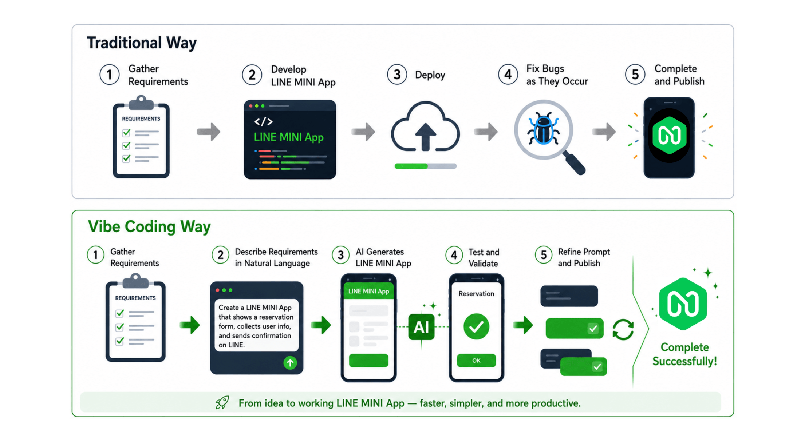

### Tools ยอดนิยมสำหรับ Vibe Coding

ปัจจุบันมีเครื่องมือ Vibe Coding หลายตัวที่ได้รับความนิยม เช่น [Google AI Studio](https://ai.studio/build/) สำหรับสร้าง Full-stack App จาก Prompt และ Deploy ได้ทันที, [Cursor](https://cursor.com/) เป็น AI-powered IDE ช่วยเขียนและแก้โค้ดในโปรเจกต์จริง, [Claude Code](https://docs.anthropic.com/en/docs/claude-code) ทำงานเป็น AI Agent ใน Terminal 

<aside class="positive">
<strong>Note:</strong> ใน Workshop นี้เราใช้ <strong>Google AI Studio</strong> สร้างเว็บจองร้านอาหาร และแปลงเป็น LINE MINI App แต่หลักการ Vibe Coding ใช้ได้กับเครื่องมืออื่นๆ ด้านบนเช่นกัน
</aside>


## สร้างเว็บจองร้านอาหาร ด้วย Google AI Studio

Duration: 0:20:00

ในช่วงนี้คุณจะใช้ Google AI Studio สร้างเว็บจองร้านอาหารแบบ ด้วยการ Vibe Code ซี่งจะเป็นการสั่งผ่าน Prompt ที่ทำให้เราไม่ต้องเขียนโค้ดเอง

### เปิด Google AI Studio

1. ไปที่ [Google AI Studio](https://aistudio.google.com/welcome)
2. กด **Get started** จากหน้า Welcome
3. เข้าสู่ระบบด้วยบัญชี Google — เลือกบัญชีที่ต้องการใช้งาน

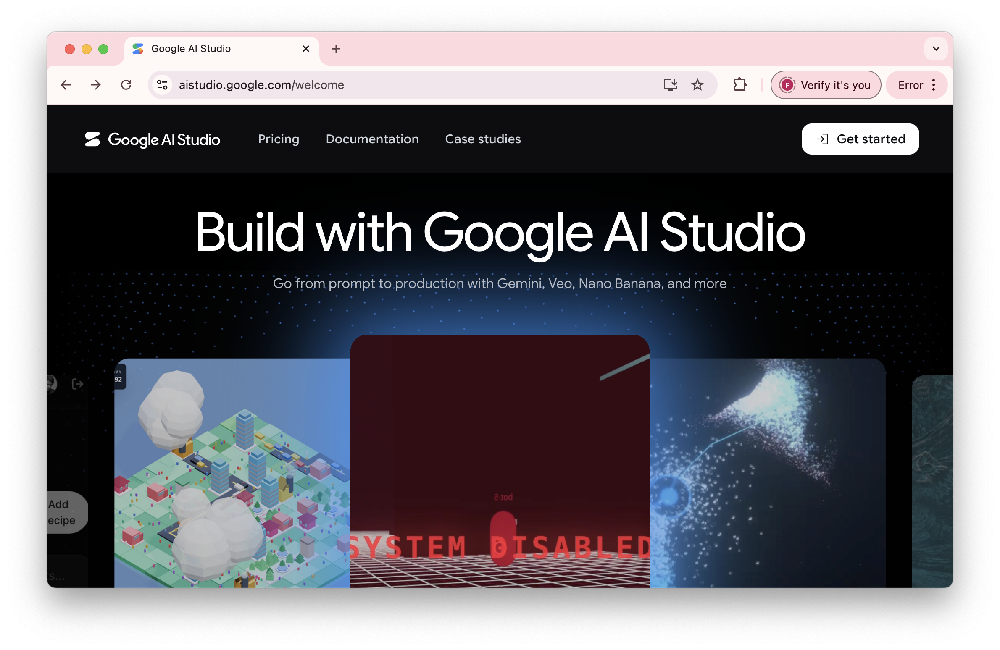
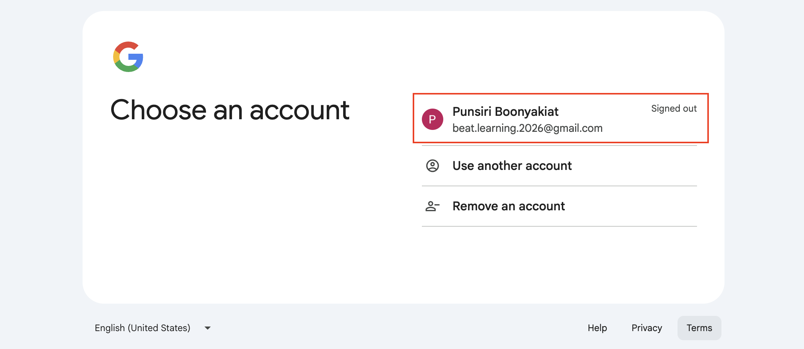
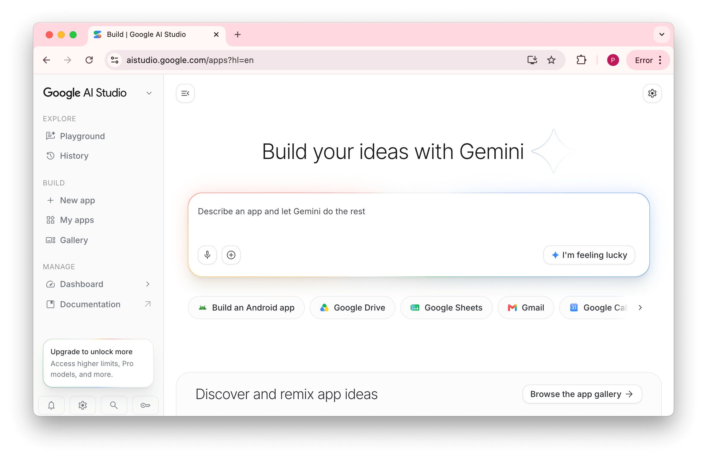


### Prompt สร้างเว็บจองร้านอาหาร

Prompt ที่ดีสำหรับ Vibe Coding ควรแบ่งเป็นส่วนชัดเจน เพื่อให้ AI เข้าใจทั้ง หน้าตา (UI) และ การทำงาน (Logic)ของแอป โดยโครงสร้างพื้นฐานที่ใช้ใน Codelab นี้มี 5 ส่วนหลัก:

1. เป้าหมาย (Goal) — บอกสั้นๆ ว่าอยากได้แอปอะไร เช่น "เว็บจองร้านอาหาร mobile-first พร้อม React frontend และ Express backend"
2. UI/UX Design System — กำหนดโทน สี ฟอนต์ และ layout ที่ต้องการ เพื่อให้ผลลัพธ์สวยและสม่ำเสมอ
3. Component Flow & Frontend Logic — อธิบายหน้าจอและองค์ประกอบทีละส่วน พร้อมพฤติกรรมของผู้ใช้ (เช่น ปุ่มกดแล้วเกิดอะไร)
4. API & Server-Side Data Layer — ระบุ Backend, endpoint, และโครงสร้างข้อมูลที่ต้องเก็บ
5. Expected Output Structure — บอกชัดว่าต้องการไฟล์อะไรบ้าง เช่น `server.js`, `App.jsx` เพื่อให้ AI จัดโค้ดให้เป็นระเบียบ

<aside class="positive">
<strong>Tip:</strong> ยิ่งระบุรายละเอียดในแต่ละส่วนชัดเจน ผลลัพธ์จาก AI จะยิ่งตรงกับที่ต้องการ — หลักการนี้ใช้ได้กับ Prompt ทุกขั้นตอนใน Codelab นี้
</aside>

หลังเข้าสู่ระบบแล้ว จะมาที่หน้า **Build** — กด **+ New app** หรือใช้ช่อง **Describe an app and let Gemini do the rest**

วาง Prompt ด้านล่างนี้ในช่อง prompt แล้วกด Build:

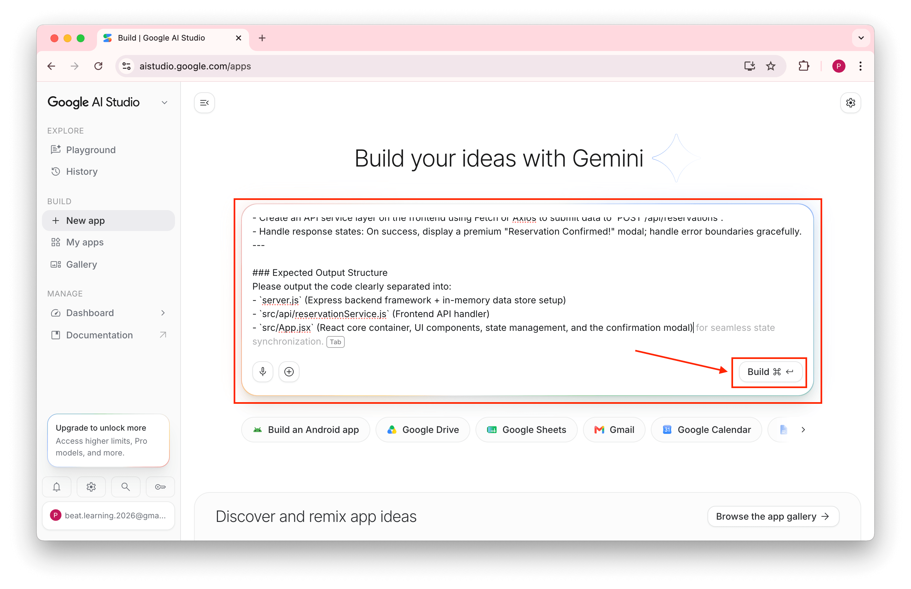

```
Generate a complete, mobile-first restaurant reservation application. Deliver both the React frontend (Vite) and the Express backend code.

### UI/UX Design System 
- Restaurant name: The Green Table
- Aesthetic: Premium, clean, elegant, minimal dining experience.
- Palette: White background, soft gray cards/borders (`bg-gray-50`, `border-gray-100`).
- Accent Color: Premium Green (`#00C853` / Tailwind arbitrary class `bg-[#00C853]` or text `text-[#00C853]`).
- Layout: Single-column, spacious layout with large touch-friendly interactive targets (minimum 48px height).

### Component Flow & Frontend Logic
1. Header: Premium restaurant branding and subtitle.
2. Guest Selector: Counter UI with large Plus/Minus buttons. Constraints: Default = 2, Min = 1, Max = 10.
3. Dining Date: Horizontal scrollable date picker cards showing Day of week and Date (e.g., "Thu 11"). Display the selected full date prominently above the cards. Today should be highlighted by default. Selected card uses the Green accent background with white text.
4. Preferred Time: Grid of rounded selectable buttons split into two categories:
   - Lunch: 11:30, 12:00, 12:30, 13:00, 13:30, 14:00
   - Dinner: 17:30, 18:00, 18:30, 19:00, 19:30, 20:00, 20:30, 21:00
   (Selected button switches to Green background with white text).
5. Contact Info Form: Full Name (Required), Mobile Number (Required, tel type), Special Request (Optional, textarea).
6. Action Button: "Reserve Now" (Disabled until form is completely filled. Triggers loading state on click).
---

### API & Server-Side Data Layer

#### 1. Node.js/Express Server (`server.js`)
- Configure an Express application with JSON parsing middleware and CORS enabled.
- Maintain an in-memory array (`const reservations = [];`) on the server to hold active bookings.

#### 2. REST API Endpoint: `POST /api/reservations`
- Receives the reservation payload.
- Validates required inputs.
- Generates a unique `id` and a `createdAt` timestamp server-side.
- Appends the reservation object to the server's local in-memory array.
- Object Data Structure to save:
  * `id`: Unique string or string-timestamp
  * `guests`: Number
  * `date`: String (YYYY-MM-DD)
  * `time`: String (HH:mm)
  * `customerName`: String
  * `customerPhone`: String
  * `specialRequest`: String
  * `createdAt`: ISO Timestamp string
  * `status`: "pending"

#### 3. Client-Side API Handling
- Create an API service layer on the frontend using Fetch or Axios to submit data to `POST /api/reservations`.
- Handle response states: On success, display a premium "Reservation Confirmed!" modal; handle error boundaries gracefully.
---

### Expected Output Structure
Please output the code clearly separated into:
- `server.js` (Express backend framework + in-memory data store setup)
- `src/api/reservationService.js` (Frontend API handler)
- `src/App.jsx` (React core container, UI components, state management, and the confirmation modal)
```

เมื่อ AI สร้าง Design หลายแบบ ให้เลือกสไตล์ที่ชอบ (เช่น **Clean Minimalism**) จากรายการทางขวา แล้วกด **Select this design**

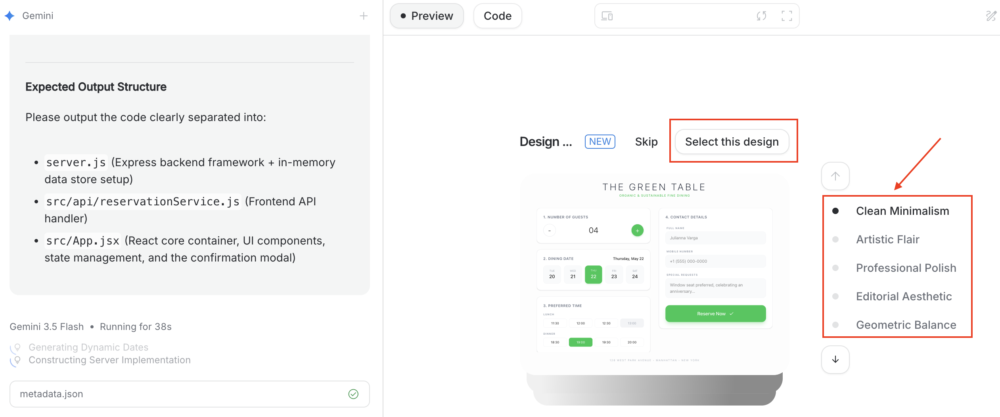

<aside class="positive">
<strong>Tip:</strong> ถ้า UI ยังไม่ตรงใจ ให้ใช้ **Annotation Mode** วาดวงรอบส่วนที่ต้องการแก้ แล้ว Prompt เพิ่ม เช่น "เปลี่ยนชื่อร้านเป็น The Green Table" หรือ "เพิ่มโลโก้ร้านด้านบน"
</aside>

### Prompt เพื่อปรับปรุงเว็บ (Optional)
หากต้องการปรับแต่งเว็บให้สมบูรณ์ขึ้นหลังได้ Design แรกแล้ว เช่น ใส่ hero image แสดงเมนูอาหาร หรือปรับ UI ให้ตรงกับแบรนด์มากขึ้น วาง Prompt ด้านล่างในช่องแชทของ Google AI Studio แล้วกดส่ง

```
Add a beautiful hero image to the page header.
Display a sample menu in a carousel format with high-quality food images.
Show the dish name, short description, and price for each menu item.
Keep the existing reservation flow and Premium Green design unchanged.
```

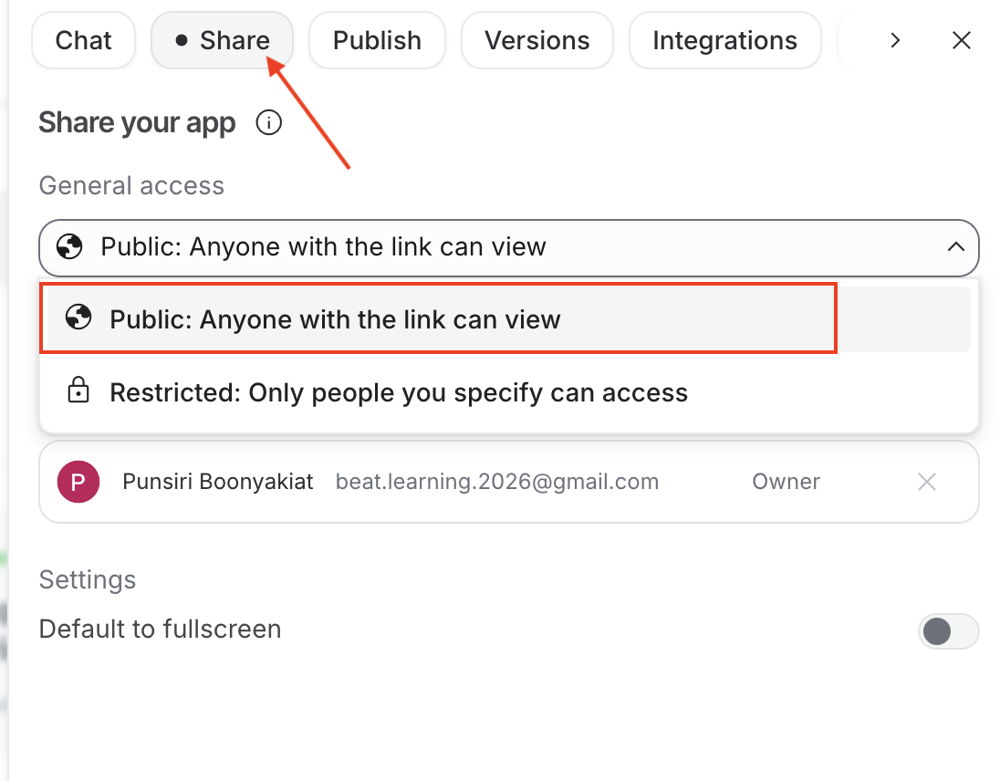

หลัง AI สร้างเสร็จ คุณจะได้เว็บที่ปรับปรุงตามที่ระบุใน Prompt

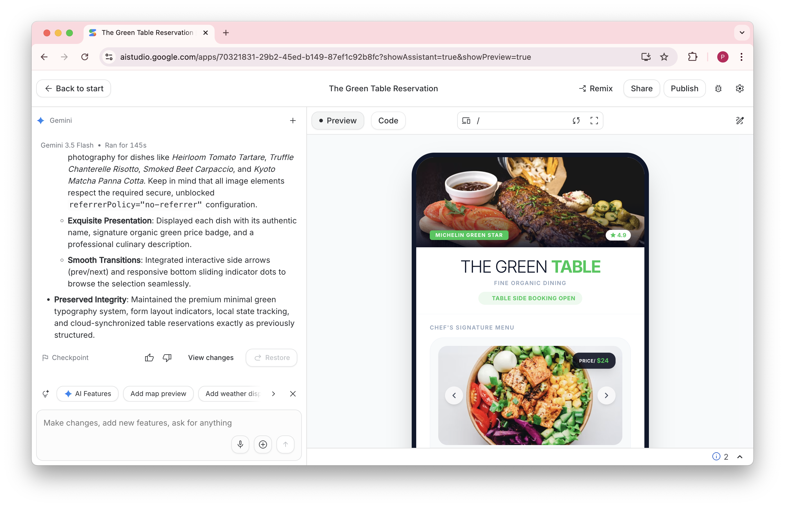

### แชร์ Public และคัดลอก Shared URL

ก่อนแปลงเป็น LINE MINI App คุณต้องแชร์ Web App แบบ Public ก่อน แล้วคัดลอก Shared URL จาก Google AI Studio — นำไปใช้เป็น Endpoint URL ในหัวข้อ ตั้งค่า LINE MINI App

#### ตั้งค่า General access เป็น Public

1. กดปุ่ม **Share** จากแถบด้านบนของโปรเจกต์
2. ใน dialog **Share your app** ที่ **General access** เลือก **Public: Anyone with the link can view**


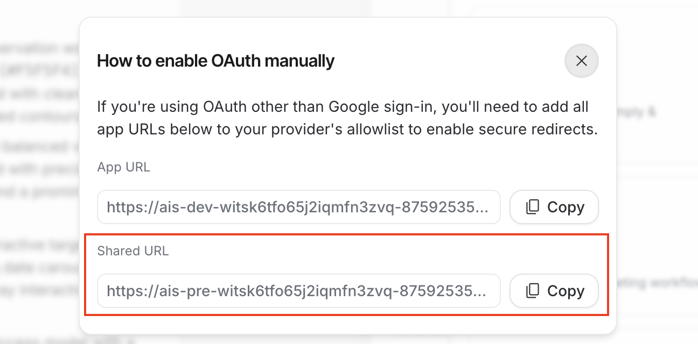

#### คัดลอก Shared URL

1. เปิดแท็บ **Integrations** จากแถบด้านบน
2. เลือก **Enable OAuth manually** (Self-serve authentication)

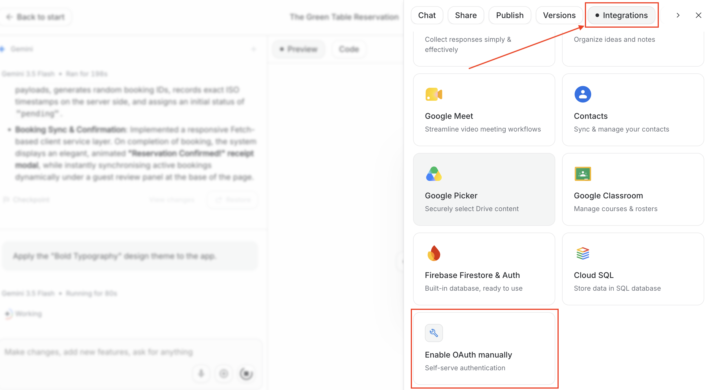

3. ในหน้าต่าง **How to enable OAuth manually** คัดลอก **Shared URL** (ไม่ใช่ App URL) ไว้ใช้ในขั้นตอนถัดไป

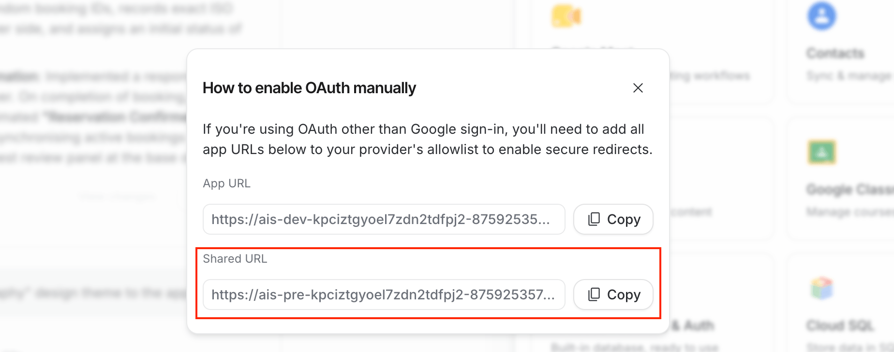

<aside class="positive">
<strong>Tip:</strong> เก็บ <strong>Shared URL</strong> ไว้ใช้ตอนเพิ่ม <strong>Endpoint URL</strong> ในหัวข้อ <strong>ตั้งค่า LINE MINI App</strong> — ใช้ Shared URL แทน App URL เพราะเป็นลิงก์ที่เข้าถึงได้หลังแชร์ Public แล้ว
</aside>

### ทดสอบเว็บ

เปิด Shared URL ที่คัดลอกไว้ในเบราว์เซอร์เพื่อทดสอบ Web App

- เลือกจำนวนแขก (+ / −) ได้
- เลือกวันที่และช่วงเวลา (Lunch / Dinner) ได้
- กรอกชื่อ เบอร์โทร และ Special Request ได้

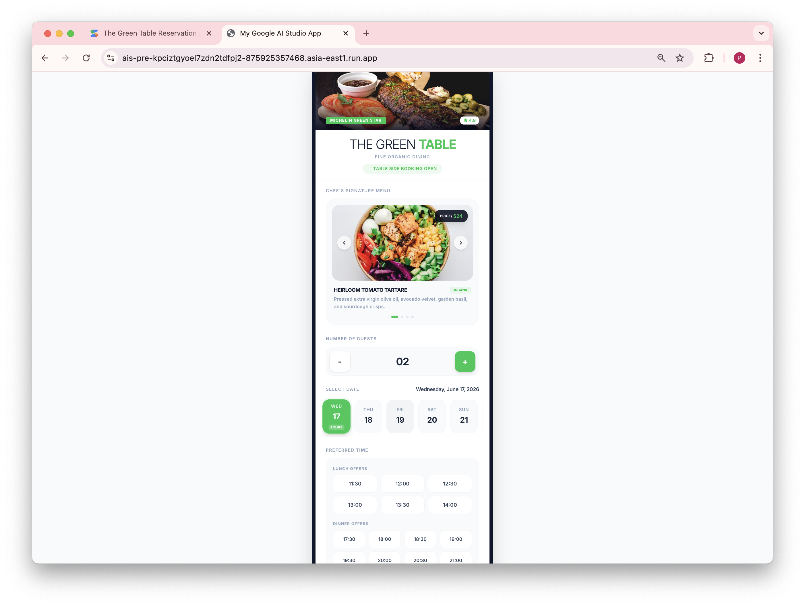

## ทำความรู้จัก LINE MINI App

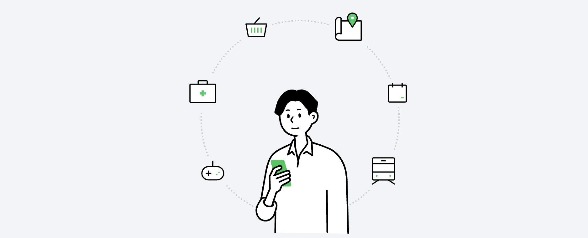

### LINE MINI App คืออะไร?
LINE MINI App คือเว็บแอปพลิเคชันที่ทำงานภายในแอป LINE ช่วยให้ผู้ใช้งานเข้าถึงบริการต่าง ๆ ได้โดยไม่ต้องติดตั้งแอปเพิ่มเติม โดยนักพัฒนาสามารถเชื่อมต่อกับฟีเจอร์ของ LINE ผ่าน SDK ที่ LINE เตรียมไว้ให้ เช่น การเข้าถึงข้อมูลผู้ใช้งาน การใช้ LINE Login และการส่งข้อความกลับไปยังห้องแชท ทำให้สามารถสร้างประสบการณ์การใช้งานที่เชื่อมต่อกับ LINE ได้อย่างไร้รอยต่อ

### ฟีเจอร์ของ LINE MINI App ที่ใช้งานใน Codelab นี้ 

#### 1. ดึงข้อมูลโปรไฟล์ผู้ใช้ (LINE User Profile)

LINE MINI App ดึงข้อมูลโปรไฟล์ของผู้ใช้ที่ Login ด้วย LINE ได้ผ่าน LIFF API:

- **`liff.login()`** — เปิดหน้า LINE Login เมื่อผู้ใช้ยังไม่ได้เข้าสู่ระบบ
- **`liff.getProfile()`** — ดึงรูปโปรไฟล์และ Display Name หลัง Login สำเร็จ

อ้างอิง: [Getting user profiles](https://developers.line.biz/en/docs/liff/getting-user-profile/)

####  2. ใช้งานบน External Browser
LINE MINI App สามารถเปิดใช้งานได้ทั้งภายในแอป LINE บนสมาร์ทโฟน และผ่าน External Browser เช่น Chrome หรือ Safari โดยช่วยให้ผู้พัฒนาไม่ต้องสร้างระบบ Authentication หรือระบบจัดการบัญชีผู้ใช้งานขึ้นมาเอง ลดทั้งเวลาและความซับซ้อนในการพัฒนา

- **`withLoginOnExternalBrowser: true`** — ตั้งค่าตอน `liff.init()` เพื่อให้ LINE Login ทำงานในเบราว์เซอร์ภายนอก
- **`liff.isInClient()`** — ตรวจสอบว่าแอปรันอยู่ในแอป LINE หรือ External Browser
- **`liff.getContext()`** — ดึงข้อมูลสภาพแวดล้อมสำหรับปรับพฤติกรรมแอป

อ้างอิง: [Open MINI App in external browser](https://developers.line.biz/en/docs/line-mini-app/develop/external-browser/)

#### 3. ส่งข้อความให้ เพื่อนหรือกลุ่ม ด้วย Share Target Picker

Share Target Picker เป็นฟีเจอร์ของ LIFF ที่ให้ผู้ใช้เลือก เพื่อนหรือกลุ่ม ใน LINE เพื่อส่งข้อความกลับไปยังห้องแชทของผู้ใช้ได้ทั้งในรูปแบบของ Text Message และ Flex Message ซึ่งใน Codelab นี้จะเป็นการชวนเพื่อมาทานอาหารด้วยกัน

อ้างอิง: [Sharing targets with Share Target Picker](https://developers.line.biz/en/docs/liff/sharing-target-picker/)

#### 4. ส่งข้อความแจ้งเตือนด้วย Service Message

Service Messages เป็นฟีเจอร์หนึ่งใน LINE MINI App ที่ให้ผู้ให้บริการส่งข้อความแจ้งเตือนไปยังผู้ใช้งาน LINE MINI App ได้โดยไม่มีค่าบริการ และไม่จำเป็นต้อง Add ตัว LINE OA ใดๆ เช่น เมื่อลูกค้าเข้ามาจองโต๊ะอาหาร ทางร้านก็สามารถส่งข้อความยืนยันการจอง หรือส่งข้อความแจ้งเตือนล่วงหน้าก่อนถึงวันที่จะเข้ามาใช้บริการ
ตัวอย่าง Use Case สำหรับจองร้านอาหาร เช่น ยืนยันการจองโต๊ะสำเร็จ หรือ แจ้งเตือนก่อนถึงเวลารับประทาน

อ้างอิง: [Sending service messages](https://developers.line.biz/en/docs/line-mini-app/develop/service-messages/)

## สร้าง Provider และ Channel
Duration: 0:20:00

ก่อนสร้างเว็บและแปลงเป็น LINE MINI App คุณต้องมี Provider และ LINE MINI App Channel ใน [LINE Developers Console](https://developers.line.biz/console/) ก่อน

### สมัครเป็น LINE Developer

จุดเริ่มต้นสำหรับการพัฒนาแอปพลิเคชันต่างๆ บนแพลตฟอร์มของ LINE คือคุณจะต้องสมัครเป็น LINE Developer ก่อน

1. เข้าไปที่ [https://developers.line.biz/console/](https://developers.line.biz/console/) แล้วเลือก **LINE account** (สีเขียว) เพื่อเข้าสู่ระบบ

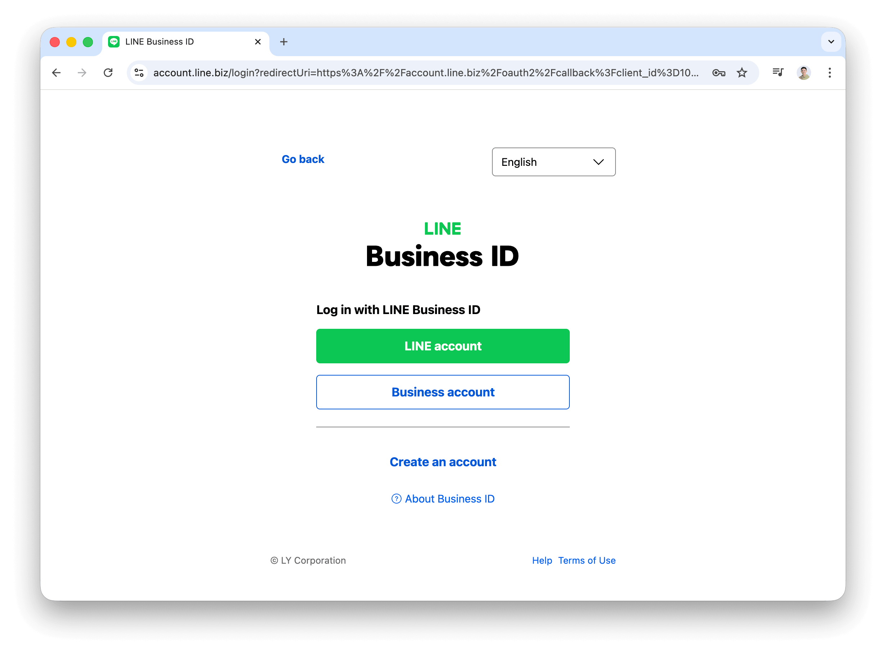

2. เข้าสู่ระบบด้วยบัญชี LINE ของคุณให้เรียบร้อย
3. กรอกชื่อและอีเมล พร้อมกดยอมรับ Agreement จากนั้นกดปุ่ม **Create my account** — เสร็จสิ้นขั้นตอนการสมัครเป็น LINE Developer

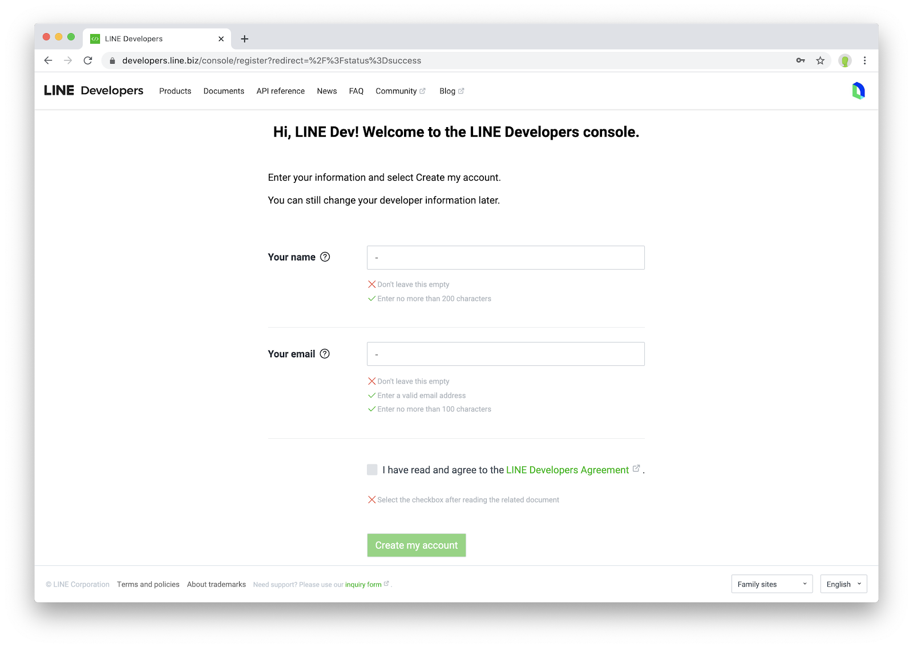

### สร้าง Provider

Provider คือ superset ของแอปทั้งหลายที่เราจะพัฒนาขึ้น รวมถึง LINE MINI App ด้วย โดยการสร้างเพียงให้ระบุชื่อของ Provider ลงไป ซึ่งอาจจะตั้งเป็นชื่อตัวเอง, ชื่อบริษัท, ชื่อทีม หรือชื่อกลุ่มก็ได้

1. ในหน้า Console คลิก **Create a new provider**
2. ระบุชื่อ Provider แล้วกด **Create**

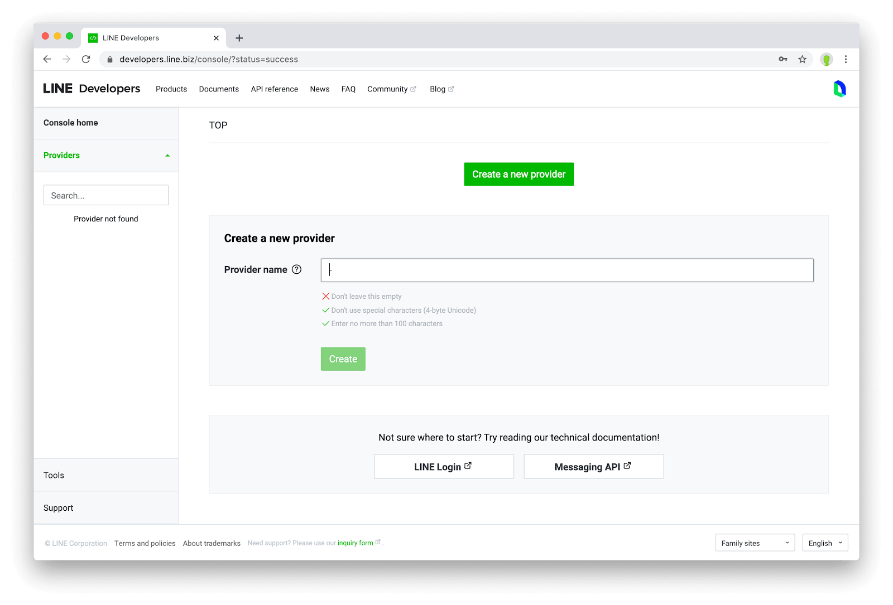

<aside class="negative">
<strong>Important:</strong> 1 Account สามารถมี Provider สูงสุดได้ 10 Providers และ<strong>ไม่สามารถมีคำว่า LINE ในชื่อ Provider</strong> ได้
</aside>

### สร้าง Channel

Channel คือ subset ของ Provider ซึ่งเปรียบเสมือนแอปพลิเคชัน

ใน Codelab นี้เราจะต้องเลือก **Create a LINE MINI App channel**

1. เลือก Provider ที่สร้างไว้ → คลิก **Create a new channel**
2. เลือก **LINE MINI App**


3. กรอกรายละเอียด Channel:

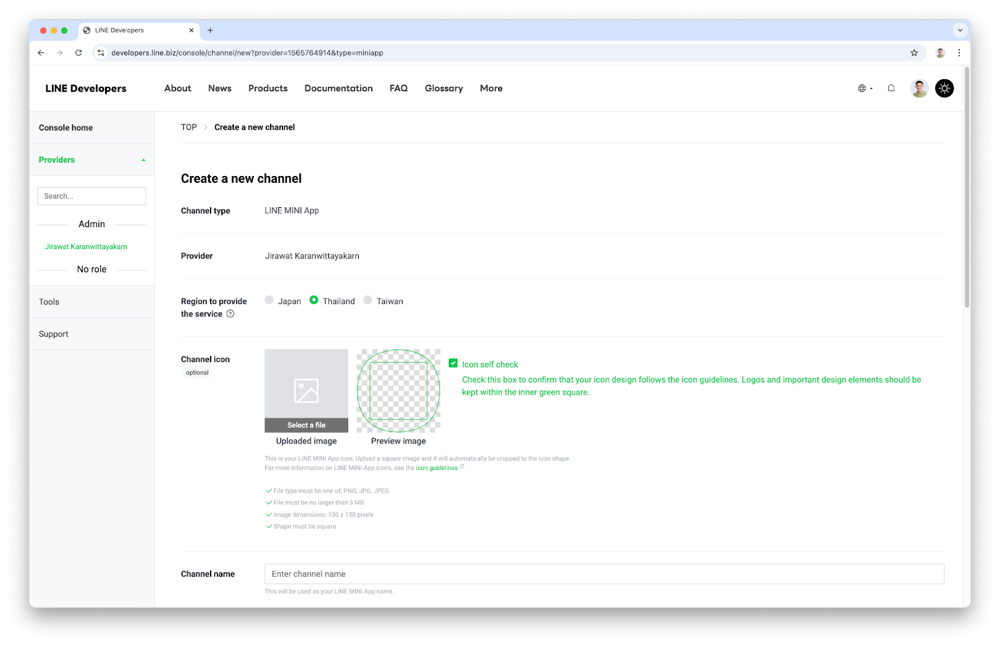

   - Channel name: `Restaurant Reservation`
   - Channel description: `บริการจองโต๊ะร้านอาหาร The Green Table`
   - Category: เลือกหมวดที่เหมาะสม (เช่น Food & Drink)
4. กดสร้าง Channel

<aside class="positive">
<strong>Note:</strong> ส่วนของ Channel icon และ Terms of Use สามารถระบุภายหลังได้
</aside>


## ตั้งค่า LINE MINI App
Duration: 0:15:00


หลังจากที่คุณมี Provider และ LINE MINI App channel เรียบร้อยแล้ว ขั้นตอนต่อไปเราจะมาตั้งค่าเพื่อใช้งาน LINE MINI App กัน โดยใน channel ให้เราเลือกแท็บ **Web app settings** 


<aside class="positive">
<strong>Note:</strong> ใช้ Channel <strong>Restaurant Reservation</strong> ที่สร้างไว้ในขั้นตอน <strong>สร้าง Provider และ Channel</strong> และเตรียม <strong>Shared URL</strong> ของ Web App จาก Google AI Studio ไว้แล้ว
</aside>

### ค้นหา LIFF ID

1. ไปที่ [LINE Developers Console](https://developers.line.biz/console/)
2. เลือก Channel Restaurant Reservation
3. เปิดแท็บ **Web app settings**
4. คัดลอก LIFF ID จาก LIFF URL แบบ **Developing** — ส่วนที่ตามหลัง `https://miniapp.line.me/` เช่น `2010347080-K2dCFtFf`

```
https://miniapp.line.me/xxxxxxxxxx-xxxxxxxx
```

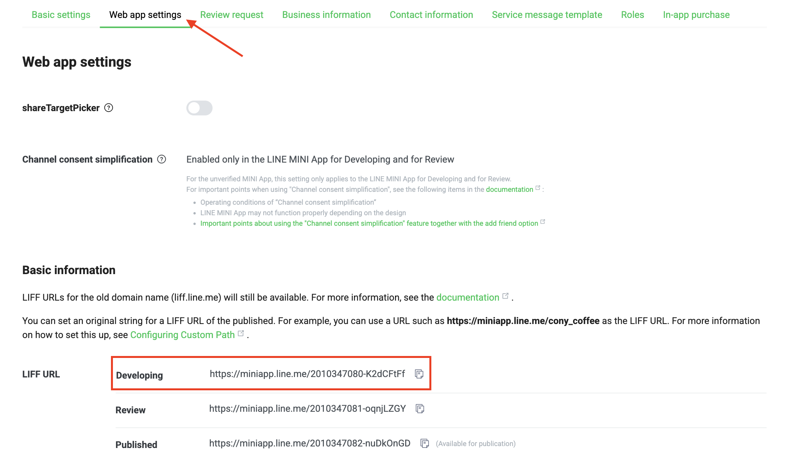

<aside class="positive">
<strong>Tip:</strong> เก็บ <strong>LIFF ID</strong> ไว้ใช้ใน Prompt ขั้นตอนถัดไป
</aside>

### เพิ่ม Endpoint URL

Endpoint URL คือ URL ที่รองรับ HTTPS ซึ่ง LINE จะใช้โหลด Web App ของคุณเมื่อผู้ใช้เปิด MINI App

1. ในแท็บ **Web app settings** → หา Endpoint URL
2. วาง Shared URL จาก Google AI Studio (หัวข้อ สร้างเว็บจองร้านอาหาร > แชร์ Public และคัดลอก Shared URL) ลงในช่อง **Developing** (ต้องขึ้นต้นด้วย `https://`)
3. คลิก **Update** เพื่อบันทึก

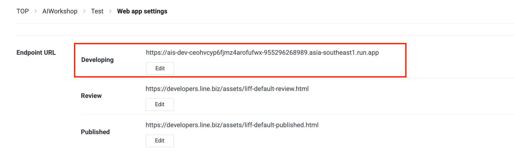

<aside class="negative">
<strong>Important:</strong> ต้องตั้ง <strong>Endpoint URL</strong> ก่อนส่ง Prompt แปลงเป็น LINE MINI App — ถ้ายังไม่ได้ตั้งค่า MINI App จะโหลดหน้าเว็บไม่ได้
</aside>


## แปลงเว็บเป็น LINE MINI App
Duration: 0:45:00

ในช่วงนี้คุณจะใช้ Google AI Studio เพื่อแปลงเว็บที่มีอยู่แล้วให้เป็น LINE MINI App

### ฟีเจอร์ของ LINE MINI App ที่จะใช้ในขั้นตอนนี้

- ดึงข้อมูลโปรไฟล์ผู้ใช้ — Login ด้วย LINE แล้วนำรูปและชื่อมาแสดงบนหน้าแอป โดยไม่ต้องให้ผู้ใช้กรอกซ้ำ
- ใช้งานบน External Browser — เปิด MINI App นอกแอป LINE ได้ (เช่น Chrome, Safari บนมือถือ)

### ส่ง Prompt แปลงเป็น LINE MINI App
วาง Prompt ด้านล่างใน Google AI Studio แทนที่ `YOUR_LIFF_ID` ด้วย LIFF ID จากหัวข้อ ตั้งค่า LINE MINI App แล้วกดส่ง Prompt

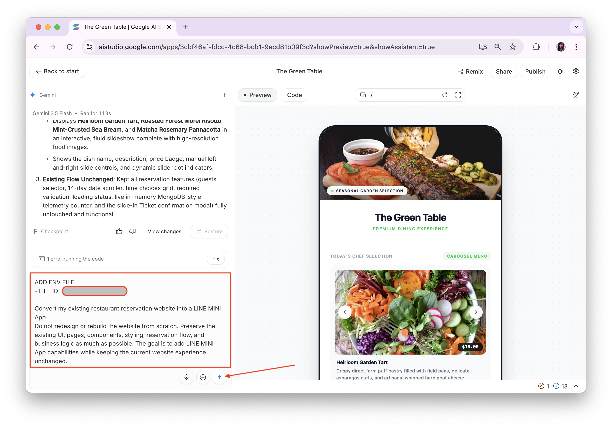


```
ADD ENV FILE: 
- LIFF ID: YOUR_LIFF_ID

Convert my existing restaurant reservation website into a LINE MINI App.
Do not redesign or rebuild the website from scratch. Preserve the existing UI, pages, components, styling, reservation flow, and business logic as much as possible. The goal is to add LINE MINI App capabilities while keeping the current website experience unchanged.

### Requirements
- Integrate LIFF and LINE Login into the existing application.
- Add a LINE User Profile Card at the top of the reservation page.
- Display the user's LINE profile picture and display name after successful login.
- Automatically populate the Customer Name field with the LINE display name.
- Keep the Customer Name field editable by the user.
- IMPORTANT: Do not force automatic login when the page loads. Do not call liff.login() on init or page load.
- Show a LINE Login button when the user is not logged in. Call liff.login() only when the user clicks the Login button.
- When the Login button is clicked:
  - If liff.isLoggedIn() is false, call liff.login().
  - If already logged in, load the user's profile using liff.getProfile().
- Show a Logout button when the user is logged in.
- When Logout is clicked: call liff.logout().

---

### LIFF Setup
- Initialize LIFF with liff.init({ liffId }) and withLoginOnExternalBrowser: true only.
- Never auto-trigger liff.login() during initialization or on first render.
- Support both LINE in-app browser and external browsers (Chrome, Safari, desktop browsers).
- Use liff.isInClient() to detect whether the app is running inside LINE.
- Use liff.getContext() to retrieve environment information for debugging and application behavior.
```


### ทดสอบ LINE MINI App

#### ทดสอบในแอป LINE:
- เปิด MINI App ผ่าน LIFF URL ได้
- เห็น User Profile Card พร้อมรูปโปรไฟล์และ Display Name
- จองโต๊ะได้ตามปกติ

#### ทดสอบบน External Browser:
- เปิด Endpoint URL ใน Chrome หรือ Safari ได้
- หลัง Login สำเร็จ จะเห็น User Profile Card พร้อมรูปโปรไฟล์และ Display Name และปุ่ม **Logout**
- จองโต๊ะได้ตามปกติ


## ส่งและแชร์ข้อความ
Duration: 0:15:00

### เปิด shareTargetPicker และตั้งค่า Scope

ก่อนส่ง Prompt ต้องเปิดใช้งาน shareTargetPicker และเพิ่ม Scope ที่จำเป็นใน LINE Developers Console

1. ไปที่ [LINE Developers Console](https://developers.line.biz/console/)
2. เลือก Channel Restaurant Reservation
3. เปิดแท็บ **Web app settings**
4. เปิดสวิตช์ **shareTargetPicker** เป็น **ON**

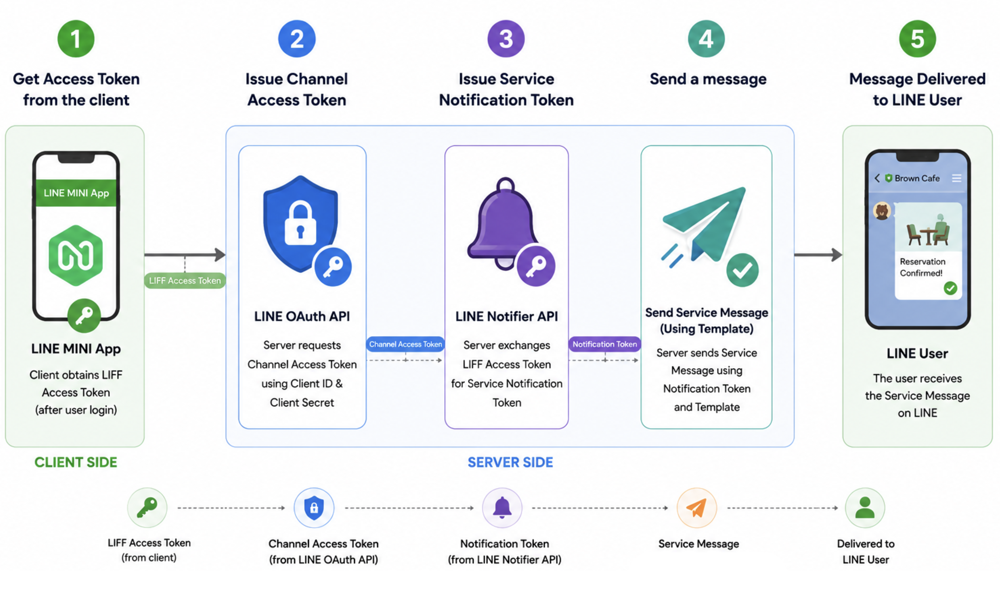

5. ในส่วน **Scopes** กด **Edit** แล้วเพิ่ม **`chat_message.write`** — Scope นี้จำเป็นสำหรับส่งข้อความผ่าน Share Target Picker (ควรมี `openid` และ `profile` อยู่แล้วจากขั้นตอนก่อนหน้า)

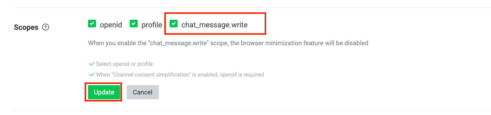

<aside class="negative">
<strong>Important:</strong> เมื่อเปิด scope <code>chat_message.write</code> ฟีเจอร์ browser minimization จะถูกปิดใช้งาน — ผู้ใช้ต้อง <strong>Login แล้ว</strong> ก่อนจึงจะเรียก <code>liff.shareTargetPicker()</code> ได้
</aside>

### ส่ง Prompt Share Target Picker

```
Add an "Invite Friends" button below the LINE User Profile Card.

### Requirements
- Show the button only when liff.isApiAvailable("shareTargetPicker") returns true.
- Hide the button if Share Target Picker is not available.
- Keep the reservation app working normally regardless of availability.

### When the button is clicked
- Open LINE Share Target Picker.
- Send a Flex Bubble invitation message.
- Include the restaurant image as the hero image.
- Display the restaurant name "The Green Table".
- Show the message: "มาจองโต๊ะด้วยกันที่ The Green Table"
- Add a prominent CTA button: "จองโต๊ะเลย"
- The CTA button must open the LINE MINI App reservation URL.
- Include the MINI App URL in the Flex message so recipients can open the reservation page directly.

Keep the existing UI, styling, and reservation functionality unchanged.
```

หลัง AI สร้างเสร็จ จะเห็นปุ่ม **Invite Friends** ใต้ LINE User Profile Card


### ทดสอบ Share Target Picker

1. เปิด MINI App ผ่านแอป LINE บนมือถือ
2. กดปุ่ม **Invite Friends**
3. เลือกเพื่อนหรือกลุ่มที่ต้องการแชร์
4. ตรวจสอบว่าได้รับ Flex Message คำเชิญจองโต๊ะ

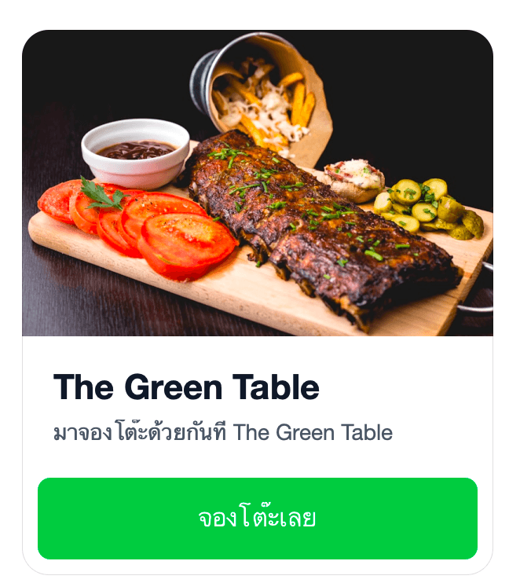


## เพิ่ม Template ของ Service Messages
Duration: 0:30:00

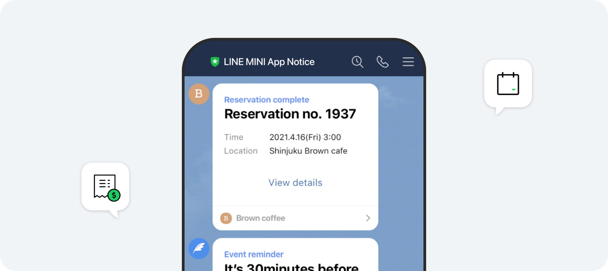

<aside class="positive">
<strong>Note:</strong> การเปิดใช้ LINE MINI App ของผู้ใช้งาน 1 ครั้ง ผู้ให้บริการจะมีสิทธิ์ในการส่งข้อความ Service Messages ให้ผู้ใช้งานคนดังกล่าวได้สูงสุด 5 ข้อความ
</aside>

<aside class="negative">
<strong>Important:</strong> LINE MINI App ไม่อนุญาตให้ส่งข้อความโฆษณาหรือโปรโมชันต่างๆได้ <a href="https://developers.line.biz/en/docs/line-mini-app/service/service-operation/#conditions-for-service-messages">รายละเอียดเพิ่มเติม</a>
</aside>

### เพิ่ม Template ของ Service Messages


ขั้นตอนต่อไปเราจะมาสร้าง Template ของข้อความกัน โดยใน Channel ให้เราเลือกแท็บ **Service message template** แล้วกดปุ่ม **Add** สีเขียวทางด้านขวาล่าง

1. ไปที่ [LINE Developers Console](https://developers.line.biz/console/)
2. เลือก Channel Restaurant Reservation (Developing)
3. เปิดแท็บ **Service message template**
4. คลิกปุ่ม **Add** (สีเขียว มุมขวาล่าง)

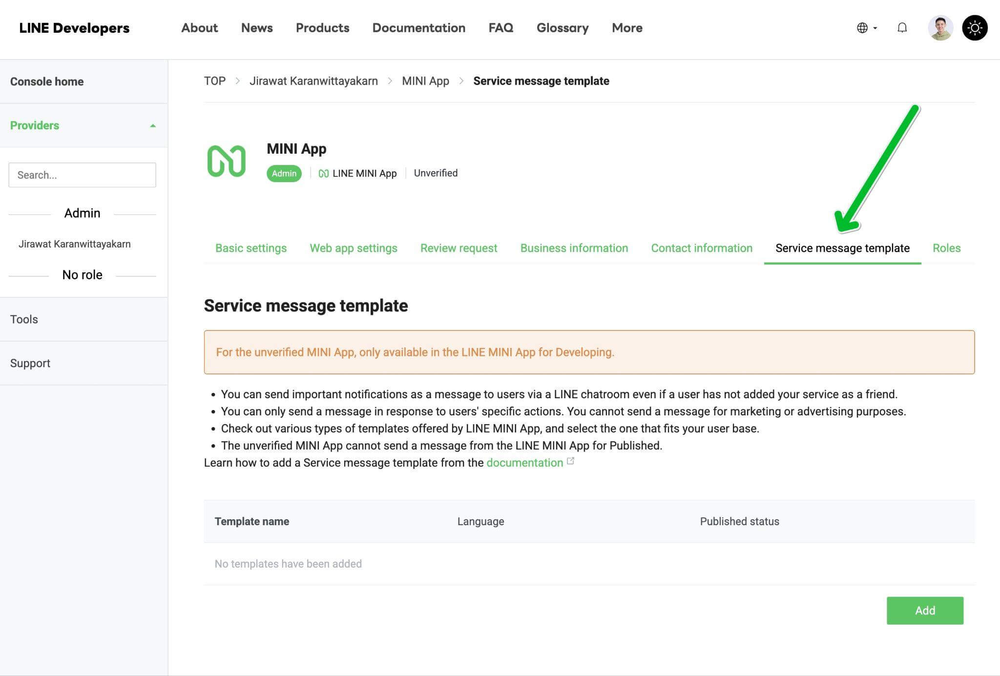

#### เพิ่ม Template ที่ต้องการ

ให้เลือก Template ที่ต้องการ โดยจะต้องเลือก Category, Language และ Template name — เมื่อเลือกแล้วเราจะได้ Template name สำหรับนำไปใช้กับ API ในขั้นตอนต่อไป

สำหรับ Codelab นี้ ให้เลือก Template ดังนี้:
- Category: Book
- Language: Thai
- Template name: Booking confirmed (simple)

เมื่อเลือก Template เรียบร้อยแล้ว จะสังเกตเห็นว่า Template name for API use แสดงเป็น `book_request_s_b_th` ซึ่งจะนำไปใช้ในการส่ง Service Message notification

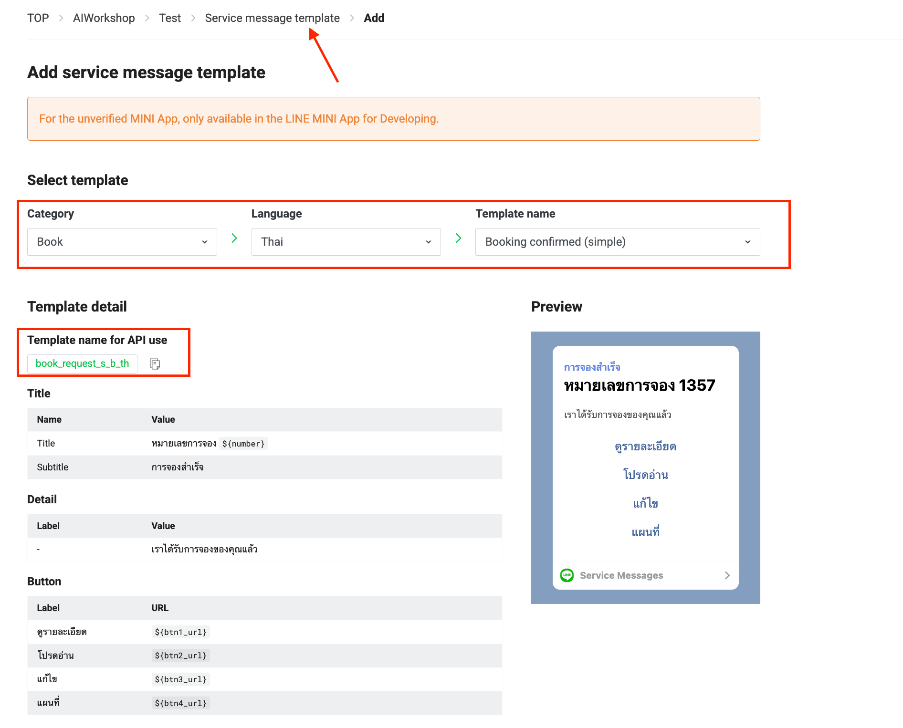

<aside class="positive">
<strong>Tip:</strong> จด Template name for API use ไว้เพื่อใช้ในขั้นตอนถัดไป 
</aside>

#### ตั้งชื่อ Use case

ระบุชื่อ Use case ให้สื่อถึงจุดประสงค์ของ Template (เช่น `Book Confirmed`) แล้วกด **Add**

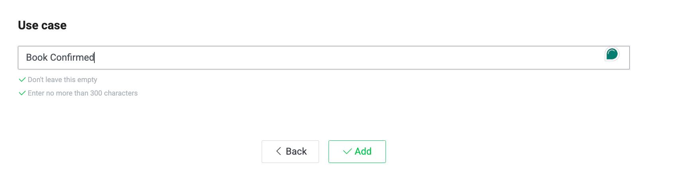

#### ทดสอบส่งข้อความด้วยตัวแปร (Template Variables)

ถัดลงมาในหน้าเดียวกัน จะพบส่วนของ Template Variables สำหรับใช้งานร่วมกับ API ซึ่งสามารถปรับค่าและทดสอบส่งข้อความได้โดยกด **Send**

```json
{
  "number": "1357",
  "btn1_url": "https://line.me",
  "btn2_url": "https://line.me",
  "btn3_url": "https://line.me",
  "btn4_url": "https://line.me"
}
```

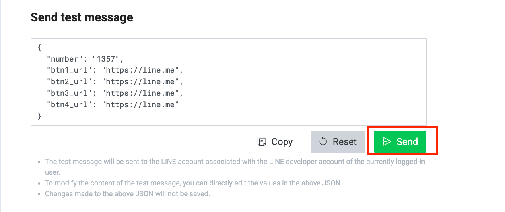

<aside class="negative">
<strong>Important:</strong> การส่งข้อความด้วย Service Messages จะสามารถเลือกประเภทของข้อความได้<strong>ตาม Template ที่ทาง LINE เตรียมไว้ให้เท่านั้น</strong>
</aside>


## Implement Service Message ใน MINI App
Duration: 0:45:00


### ทำความเข้าใจ Service Message Workflow

ใน Codelab นี้ Service Message จะถูกส่งหลังจากผู้ใช้กด Reserve Now และจองโต๊ะสำเร็จ โดยระบบจะส่งข้อความยืนยันการจองไปยังผู้ใช้ผ่าน LINE MINI App Notice โดยอัตโนมัติ

การทำงานนี้อาศัยการทำงานร่วมกันระหว่าง LINE MINI App (Frontend) และ Express Server (Backend) โดย Frontend จะส่ง LIFF Access Token และข้อมูลการจองไปยัง Backend จากนั้น Backend จะดำเนินการเรียก LINE API เพื่อยืนยันตัวตนของผู้ใช้และส่ง Service Message

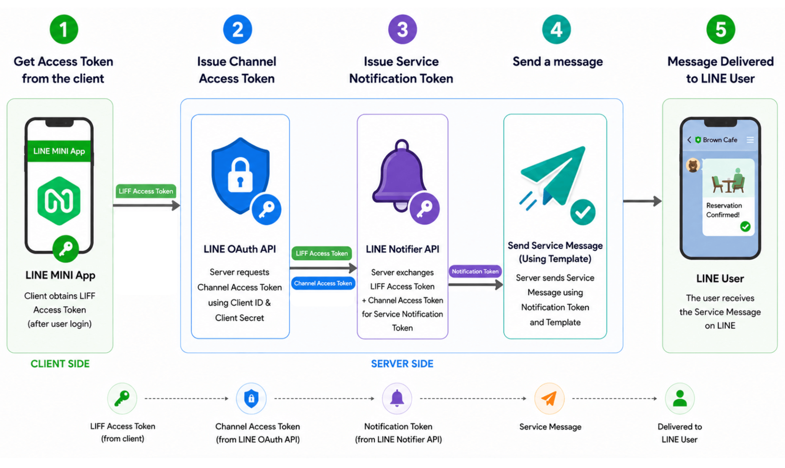

#### การส่ง Service Message ผ่าน LINE API ประกอบด้วย 4 ขั้นตอนหลักดังนี้

1. Frontend ส่ง LIFF Access Token และข้อมูลการจองไปยัง Backend
หลังจากผู้ใช้กด Reserve Now และจองโต๊ะสำเร็จ Frontend จะดึง LIFF Access Token ของผู้ใช้ที่ Login แล้ว และส่งไปยัง Backend พร้อมข้อมูลการจอง

2. Issue Channel Access Token
Backend ใช้ Channel ID และ Channel Secret เพื่อขอ Channel Access Token จาก LINE OAuth API

3. Issue Notification Token
Backend นำ LIFF Access Token ที่ได้รับจาก Frontend ไปแลกเป็น Notification Token เพื่อระบุผู้รับข้อความ

4. Send Service Message
Backend ใช้ Notification Token และ Template ที่กำหนดไว้ เพื่อส่ง Service Message ไปยังผู้ใช้ผ่าน LINE MINI App Notice

### คัดลอก Channel ID และ Channel secret

1. ไปที่ [LINE Developers Console](https://developers.line.biz/console/)
2. เลือก Channel Restaurant Reservation (Developing)
3. เปิดแท็บ **Basic settings**
4. คัดลอก Channel ID แบบ **Developing**

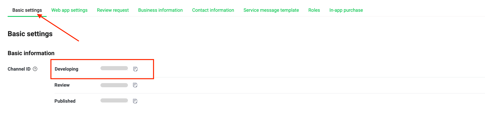

5. ในหน้าเดียวกัน เลื่อนลงมาหา Channel secret แล้วคัดลอกค่าแบบ **Developing**

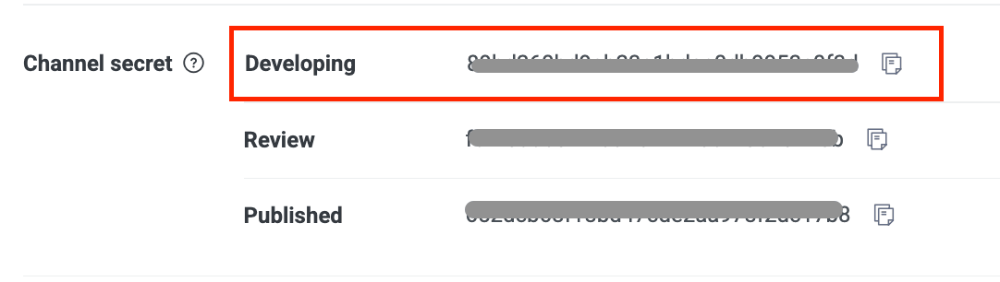

<aside class="positive">
<strong>Tip:</strong> จด <strong>Channel ID</strong> และ <strong>Channel secret</strong> ไว้ก่อน — จะนำไปใส่ใน Environment Variables ของ Google AI Studio ในขั้นตอนถัดไป
</aside>

### ส่ง Prompt และตั้งค่า Environment Variables

ในขั้นตอนนี้ให้ใช้ Prompt ใน Google AI Studio เพื่อ Implement การส่ง Service Message หลังจองโต๊ะสำเร็จ โดย Prompt จะอ้างอิง Template `book_request_s_b_th` ที่เพิ่มไว้ในขั้นตอนก่อนหน้า
เมื่อมี Channel ID และ Channel Secret พร้อมแล้ว ให้วาง Prompt ด้านล่างใน Google AI Studio แล้วกด Send

```
ADD ENV FILE: 
- CHANNEL_ID = YOUR_CHANNEL_ID
- CHANNEL_SECRET = YOUR_CHANNEL_SECRET

Implement a backend server function to send a LINE MINI App Service Message when a reservation is successfully created. Use the Service Message template `book_request_s_b_th` added in LINE Developers Console.

### Architecture & API Flow Adjustments

#### 1. Frontend Client Modification
- Update the API submission call in `src/api/reservationService.js`. 
- Extract the user's active LIFF Access Token using `liff.getAccessToken()`.
- Send this token to our Express backend via an HTTP request header named `x-liff-access-token`.

#### 2. Express Server (`server.js`) Updates
Add a dedicated helper function or expand the `POST /api/reservations` endpoint to orchestrate the 3-step LINE Service Message workflow:

- Step A: Issue Stateless Channel Access Token
  * Endpoint: `POST https://api.line.me/oauth2/v3/token`
  * Content-Type: `application/x-www-form-urlencoded`
  * Body Data: 
    - `grant_type`: `client_credentials`
    - `client_id`: `YOUR_CHANNEL_ID`
    - `client_secret`: `YOUR_CHANNEL_SECRET`

- Step B: Issue Service Notification Token
  * Endpoint: `POST https://api.line.me/message/v3/notifier/token`
  * Headers: `Authorization: Bearer <Stateless_Channel_Access_Token>`
  * Body (JSON): `{ "liffAccessToken": "<Token_From_Header>" }`
  * Response contains: `notificationToken`

- Step C: Send the Service Message
  * Endpoint: `POST https://api.line.me/message/v3/notifier/send?target=service`
  * Headers: `Authorization: Bearer <Stateless_Channel_Access_Token>`
  * Template Variables (`params`) — use real runtime values, not button label text:
    - `number` → `<reservation_id>` (Reservation ID returned after a successful booking)
    - `btn1_url`, `btn2_url`, `btn3_url`, `btn4_url` — use the LINE MINI App URL
  * Body (JSON):
    {
      "templateName": "book_request_s_b_th",
      "params": {
        "number": "<reservation_id>",
        "btn1_url": "https://miniapp.line.me/<LIFF_ID>",
        "btn2_url": "https://miniapp.line.me/<LIFF_ID>",
        "btn3_url": "https://miniapp.line.me/<LIFF_ID>",
        "btn4_url": "https://miniapp.line.me/<LIFF_ID>"
      },
      "notificationToken": "<Notification_Token_From_Step_B>"
    }

---

### Expected Output Structure
Please provide the complete, updated code blocks for:
- `src/api/reservationService.js` (Passing the `x-liff-access-token` header correctly during execution)
- `server.js` (Full Express server including the multi-step external requests to LINE's token and notifier platforms using URLSearchParams for Step A, utilizing `process.env.LINE_CHANNEL_ID` and `process.env.LINE_CHANNEL_SECRET`)
```

หลังส่ง Prompt หาก Google AI Studio แสดงหน้าต่าง **Enter your environment variable to continue** ให้กรอกค่าให้ถูกต้องตามตารางด้านล่าง แล้วกด **Apply**:

- CHANNEL_ID — วาง Channel ID แบบ Developing
- CHANNEL_SECRET — วาง Channel secret แบบ Developing


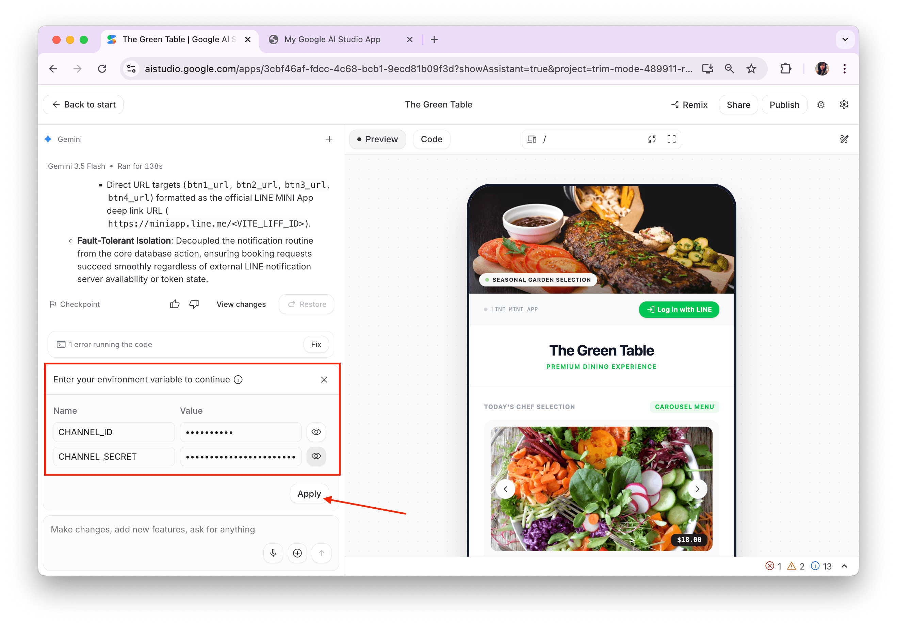

<aside class="negative">
<strong>Important:</strong> ใช้ค่าแบบ <strong>Developing</strong> เท่านั้น (ไม่ใช่ Review หรือ Published) — หากกรอกผิด การส่ง Service Message จะล้มเหลว
</aside>

### ทดสอบ Service Message

1. เปิด MINI App กรอกข้อมูลจองโต๊ะ แล้วกด **Reserve Now**

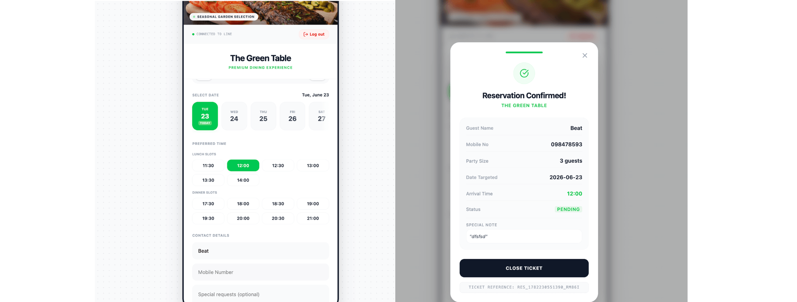

2. ตรวจสอบว่าได้รับ Service Message ยืนยันการจองผ่าน LINE MINI App Notice

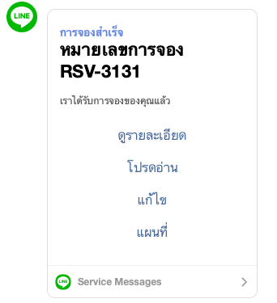


## Congratulations
Duration: 0:05:00

ยินดีด้วยครับ ถึงตรงนี้คุณก็มี LINE MINI App ตัวแรกเป็นของคุณเองแล้ว!!!

### สิ่งที่คุณได้เรียนรู้ใน Codelab นี้

✅ การสร้าง Provider และ LINE MINI App Channel ใน LINE Developers Console  
✅ การสร้างเว็บจองร้านอาหารด้วย Vibe Coding ใน Google AI Studio  
✅ การแปลงเว็บธรรมดาให้กลายเป็น LINE MINI App ด้วย Prompt  
✅ การดึงข้อมูลผู้ใช้งาน LINE (User Profile) 
✅ การรองรับการใช้งานบน External Browser  
✅ การแชร์ข้อความไปยังเพื่อนหรือกลุ่มด้วย Share Target Picker ผ่าน Prompt  
✅ การตั้งค่า Service Message Template ใน LINE Developers Console  
✅ การส่ง Service Message ยืนยันการจองด้วย Prompt ใน Google AI Studio  

### เรียนรู้เพิ่มเติม

- [บทความเกี่ยวกับ LINE MINI App ใน LINE Developers Thailand](https://medium.com/linedevth/tagged/line-mini-app)

### Reference docs

- [LINE MINI App Quickstart](https://developers.line.biz/en/docs/line-mini-app/quickstart/)
- [Google AI Studio](https://aistudio.google.com/)
- [LINE MINI App Documentation](https://developers.line.biz/en/docs/line-mini-app/)
- [Sending service messages](https://developers.line.biz/en/docs/line-mini-app/develop/service-messages/)
- [Open MINI App in external browser](https://developers.line.biz/en/docs/line-mini-app/develop/external-browser/)
- [Share Target Picker](https://developers.line.biz/en/docs/liff/sharing-target-picker/)
- [LINE MINI App API Reference](https://developers.line.biz/en/reference/line-mini-app/)

### บอกเราหน่อยว่า Codelab ชุดนี้เป็นอย่างไรบ้าง

- [Feedback form]()
